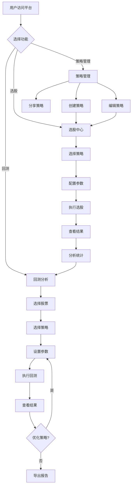

# 产品需求文档 (PRD) - wenghe量化选股平台

## 1. 产品概述
wenghe量化选股平台是一个面向A股市场的专业量化投资工具，提供基于策略的智能选股和历史回测分析功能。平台旨在帮助投资者通过量化方法发现投资机会，验证策略有效性，降低投资风险，提升决策质量。

目标用户：个人投资者、量化交易爱好者、投资研究人员、小型投资团队。

## 2. 核心功能

### 2.1 用户角色
| 角色 | 注册方式 | 核心权限 |
|------|---------|---------|
| 普通用户 | 邮箱注册 | 浏览公共策略、运行选股、查看回测结果 |
| 高级用户 | 邀请制 | 创建自定义策略、保存策略配置、导出分析报告 |

### 2.2 功能模块
1. **数据概览页**: 市场数据仪表盘、热门股票、策略推荐
2. **选股中心**: 策略选择、参数配置、选股执行、结果展示
3. **回测分析页**: 股票选择、策略配置、回测执行、结果可视化
4. **策略管理页**: 我的策略、策略创建、策略编辑、策略分享

### 2.3 页面详情
| 页面名称 | 模块名称 | 功能描述 |
|---------|---------|---------|
| 数据概览页 | 市场仪表盘 | 显示A股市场实时数据、涨跌分布、成交量统计 |
| 数据概览页 | 热门股票 | 展示涨幅榜、跌幅榜、成交量排行 |
| 数据概览页 | 策略推荐 | 推荐热门策略及其近期表现 |
| 选股中心 | 策略选择器 | 支持多因子、技术指标、基本面等策略类型选择 |
| 选股中心 | 参数配置面板 | 配置策略参数：因子权重、筛选条件、股票池范围 |
| 选股中心 | 选股结果列表 | 展示筛选出的股票及其关键指标、评分排名 |
| 选股中心 | 结果分析图表 | 对选股结果进行统计分析：行业分布、市值分布等 |
| 回测分析页 | 股票选择器 | 搜索并选择目标股票，支持批量选择 |
| 回测分析页 | 策略配置 | 选择回测策略、设置回测参数、时间范围 |
| 回测分析页 | 回测执行 | 运行回测任务、显示进度、历史记录 |
| 回测分析页 | 结果可视化 | 收益曲线、风险指标、交易记录、持仓分析 |
| 策略管理页 | 我的策略列表 | 展示用户创建的所有策略及其状态 |
| 策略管理页 | 策略创建器 | 可视化策略构建器，支持因子组合和条件设置 |
| 策略管理页 | 策略编辑器 | 编辑已有策略的参数和条件 |
| 策略管理页 | 策略分享 | 将策略设为公开或分享给特定用户 |

## 3. 核心流程

### 3.1 选股流程
用户进入选股中心 → 浏览或搜索策略 → 选择目标策略 → 配置参数和筛选条件 → 执行选股 → 查看结果列表 → 分析统计图表 → 选择股票进入回测。

### 3.2 回测流程
用户进入回测分析页 → 选择目标股票 → 选择回测策略 → 设置时间范围和参数 → 执行回测 → 查看收益曲线和风险指标 → 分析交易记录 → 优化策略参数 → 再次回测。

## 4. 用户界面设计

### 4.1 设计风格
- **主色调**: 深蓝色系(#1a237e, #283593)代表专业稳重，配合金色(#ffc107)代表财富增值
- **辅助色**: 绿色(#4caf50)表示盈利/上涨，红色(#f44336)表示亏损/下跌（符合A股习惯）
- **按钮风格**: 圆角矩形按钮，hover时微抬升阴影效果，执行按钮使用金色强调
- **字体**: 标题使用"思源黑体"或"PingFang SC"，数据展示使用等宽字体如"JetBrains Mono"
- **布局**: 左侧固定导航栏，右侧内容区采用卡片式布局
- **图标**: 使用简洁的线性图标风格，数据可视化使用专业金融图表

### 4.2 页面设计概览
| 页面名称 | 模块名称 | UI元素 |
|---------|---------|--------|
| 数据概览页 | 市场仪表盘 | 深色背景，大数字展示关键指数，渐变色卡片，实时更新动画 |
| 数据概览页 | 热门股票 | 表格布局，涨跌用绿红色区分，hover高亮行，快速筛选标签 |
| 选股中心 | 策略选择器 | 卡片式策略列表，图标+标题+简介，选中状态边框高亮，分类标签 |
| 选股中心 | 参数配置面板 | 滑块控件、输入框、下拉选择组合，实时预览效果，参数说明提示 |
| 选股中心 | 选股结果列表 | 数据表格，支持排序筛选，列头固定，分页导航，一键加入回测 |
| 回测分析页 | 结果可视化 | ECharts图表，收益曲线、收益分布、风险矩阵，支持缩放拖拽 |
| 策略管理页 | 策略创建器 | 分步引导式创建，因子库选择面板，条件组合器，实时预览策略逻辑 |

### 4.3 响应式设计
- **桌面优先**: 主要针对桌面端优化，最小宽度1200px
- **移动适配**: 平板端侧边栏可收起，关键数据表格支持横向滚动
- **触控优化**: 按钮/卡片点击区域≥44px，支持手势滑动切换图表时间范围

### 4.4 动效设计
- **页面加载**: 数据卡片依次淡入，图表曲线绘制动画
- **数据更新**: 数字变化时平滑过渡，表格行更新时闪烁提示
- **交互反馈**: 按钮点击波纹效果，策略卡片hover时微放大，图表tooltip跟随鼠标
- **状态切换**: 选股执行时进度条动画，回测完成后结果区域展开动画