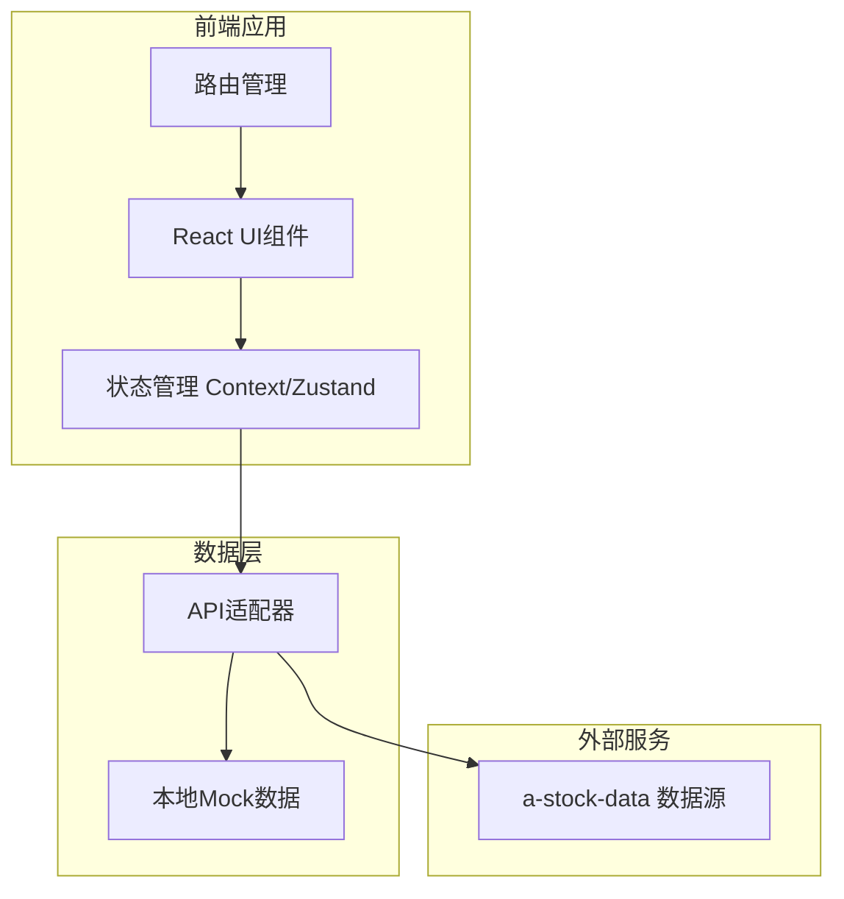
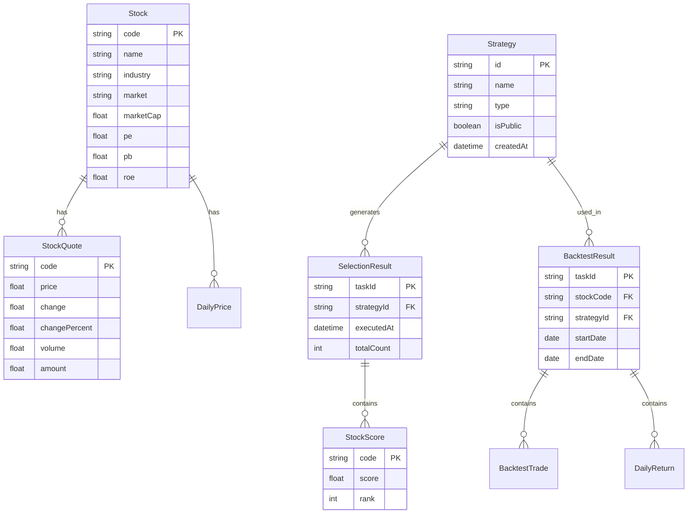

# 技术架构文档 - wenghe量化选股平台

## 1. 架构设计



## 2. 技术说明

### 2.1 技术栈
- **前端框架**: React 18 + TypeScript
- **样式方案**: Tailwind CSS 3
- **构建工具**: Vite
- **图表库**: ECharts 5 (金融级图表可视化)
- **状态管理**: Zustand (轻量级状态管理)
- **路由**: React Router 6
- **数据源**: a-stock-data (模拟数据，接口结构对接真实数据源)

### 2.2 初始化工具
- **项目创建**: `npm create vite@latest wenghe-quant-platform -- --template react-ts`

### 2.3 后端架构
- **本版本**: 无独立后端，使用Mock数据模拟
- **数据持久化**: LocalStorage存储用户策略配置
- **未来扩展**: 可对接Node.js/Express后端提供用户系统、策略存储

### 2.4 数据源集成
- **当前方案**: 本地Mock数据，模拟真实A股数据结构
- **真实数据源**: a-stock-data数据源，提供实时行情、历史数据、财务指标

## 3. 路由定义

| 路由路径 | 页面名称 | 功能描述 |
|---------|---------|---------|
| `/` | 重定向到概览页 | 默认入口 |
| `/dashboard` | 数据概览页 | 市场数据仪表盘、热门股票、策略推荐 |
| `/stock-selection` | 选股中心 | 策略选择、参数配置、选股执行、结果展示 |
| `/backtest` | 回测分析页 | 股票选择、策略配置、回测执行、结果可视化 |
| `/strategy` | 策略管理页 | 策略列表、创建、编辑、分享 |

## 4. API接口定义

### 4.1 数据接口类型定义

```typescript
// 股票基本信息
interface Stock {
  code: string;           // 股票代码
  name: string;           // 股票名称
  industry: string;       // 所属行业
  market: 'SH' | 'SZ';    // 上市市场
  marketCap: number;      // 市值(亿)
  pe: number;             // 市盈率
  pb: number;             // 市净率
  roe: number;            // 净资产收益率
}

// 股票行情数据
interface StockQuote {
  code: string;
  name: string;
  price: number;          // 当前价格
  change: number;         // 涨跌幅
  changePercent: number;  // 涨跌幅百分比
  volume: number;         // 成交量(手)
  amount: number;         // 成交额(万)
  turnover: number;       // 换手率
  high: number;           // 最高价
  low: number;            // 最低价
  open: number;           // 开盘价
  preClose: number;       // 昨收价
}

// 选股策略
interface Strategy {
  id: string;
  name: string;
  type: 'factor' | 'technical' | 'fundamental' | 'mixed';
  description: string;
  factors: StrategyFactor[];
  filters: StrategyFilter[];
  isPublic: boolean;
  createdAt: string;
  updatedAt: string;
}

// 策略因子
interface StrategyFactor {
  name: string;
  weight: number;         // 因子权重 (0-1)
  params: Record<string, any>;
}

// 筛选条件
interface StrategyFilter {
  field: string;
  operator: 'gt' | 'lt' | 'eq' | 'between';
  value: number | [number, number];
}

// 选股结果
interface SelectionResult {
  taskId: string;
  strategyId: string;
  stocks: StockScore[];
  executedAt: string;
  totalCount: number;
}

// 股票评分
interface StockScore {
  stock: Stock;
  quote: StockQuote;
  score: number;          // 综合得分
  rank: number;           // 排名
  factorScores: Record<string, number>;
}

// 回测结果
interface BacktestResult {
  taskId: string;
  stockCode: string;
  strategyId: string;
  startDate: string;
  endDate: string;
  performance: BacktestPerformance;
  trades: BacktestTrade[];
  dailyReturns: DailyReturn[];
}

// 回测绩效
interface BacktestPerformance {
  totalReturn: number;    // 总收益率
  annualReturn: number;   // 年化收益率
  maxDrawdown: number;    // 最大回撤
  sharpeRatio: number;    // 夏普比率
  winRate: number;        // 胜率
  profitLossRatio: number;// 盈亏比
  alpha: number;          // Alpha
  beta: number;           // Beta
}

// 交易记录
interface BacktestTrade {
  date: string;
  type: 'buy' | 'sell';
  price: number;
  shares: number;
  amount: number;
  reason: string;
}

// 每日收益
interface DailyReturn {
  date: string;
  value: number;          // 资产价值
  return: number;         // 日收益率
  benchmark: number;      // 基准收益率
}
```

### 4.2 API接口规范

```typescript
// 获取股票列表
interface GetStocksRequest {
  industry?: string;
  market?: 'SH' | 'SZ';
  minMarketCap?: number;
  maxMarketCap?: number;
}

interface GetStocksResponse {
  stocks: Stock[];
  total: number;
}

// 获取行情数据
interface GetQuotesRequest {
  codes: string[];
}

interface GetQuotesResponse {
  quotes: StockQuote[];
}

// 执行选股
interface RunSelectionRequest {
  strategyId: string;
  params?: Record<string, any>;
}

interface RunSelectionResponse {
  taskId: string;
  status: 'pending' | 'running' | 'completed' | 'failed';
  result?: SelectionResult;
}

// 执行回测
interface RunBacktestRequest {
  stockCodes: string[];
  strategyId: string;
  startDate: string;
  endDate: string;
  initialCapital: number;
}

interface RunBacktestResponse {
  taskId: string;
  status: 'pending' | 'running' | 'completed' | 'failed';
  result?: BacktestResult;
}

// 策略管理
interface CreateStrategyRequest {
  name: string;
  type: Strategy['type'];
  description: string;
  factors: StrategyFactor[];
  filters: StrategyFilter[];
}

interface CreateStrategyResponse {
  strategy: Strategy;
}
```

## 5. 数据模型

### 5.1 数据模型关系图



### 5.2 Mock数据说明

由于本项目使用模拟数据，以下数据将在前端静态生成：

```typescript
// Mock数据生成策略
const mockStocks: Stock[] = [
  // 生成100+只A股股票，涵盖主要行业
  // 包含真实的股票代码格式(600xxx, 000xxx, 300xxx等)
  // 包含合理的财务指标分布
];

const mockStrategies: Strategy[] = [
  // 多因子策略: 价值、成长、质量、动量
  // 技术指标策略: 均线、MACD、RSI、KDJ
  // 基本面策略: ROE、PEG、现金流
  // 混合策略: 技术+基本面
];
```

## 6. 项目目录结构

```
wenghe-quant-platform/
├── src/
│   ├── components/          # 通用组件
│   │   ├── Layout/          # 布局组件
│   │   ├── Charts/          # 图表组件
│   │   ├── Tables/          # 表格组件
│   │   └── Controls/        # 控件组件
│   ├── pages/               # 页面组件
│   │   ├── Dashboard/       # 数据概览页
│   │   ├── StockSelection/  # 选股中心
│   │   ├── Backtest/        # 回测分析页
│   │   └── Strategy/        # 策略管理页
│   ├── data/                # Mock数据
│   │   ├── stocks.ts        # 股票数据
│   │   ├── quotes.ts        # 行情数据
│   │   ├── strategies.ts    # 策略数据
│   │   └── results.ts       # 选股/回测结果数据
│   ├── hooks/               # 自定义Hooks
│   ├── store/               # 状态管理
│   ├── types/               # 类型定义
│   ├── utils/               # 工具函数
│   ├── App.tsx              # 应用入口
│   └── main.tsx             # 启动入口
├── public/                  # 静态资源
├── index.html               # HTML模板
├── tailwind.config.js       # Tailwind配置
├── vite.config.ts           # Vite配置
└── package.json             # 项目配置
```

## 7. 性能优化策略

### 7.1 数据加载
- 分页加载股票列表，避免一次性加载大量数据
- 使用虚拟滚动优化长列表渲染
- 图表数据按需加载，支持时间范围选择

### 7.2 渲染优化
- 使用React.memo避免不必要的组件重渲染
- 图表组件使用React.lazy延迟加载
- 大表格使用虚拟化技术(react-window)

### 7.3 缓存策略
- 策略配置缓存在LocalStorage
- 选股结果临时缓存，支持页面刷新恢复
- 图表实例复用，避免重复创建

## 8. 安全性考虑

### 8.1 数据安全
- 所有用户输入进行校验和过滤
- 策略参数范围限制，避免异常值
- API请求频率限制(模拟环境可忽略)

### 8.2 前端安全
- 避免在客户端存储敏感信息
- XSS防护: 对用户输入进行转义
- CSRF防护: 如对接真实后端需要token验证

## 9. 扩展性设计

### 9.1 策略扩展
- 策略因子采用插件化设计，便于新增因子
- 策略模板系统，支持从模板快速创建
- 策略导入导出功能，支持JSON格式

### 9.2 数据源扩展
- API适配器层隔离数据源差异
- 支持切换不同数据源(当前mock，未来a-stock-data)
- 数据源配置化，无需修改核心代码

### 9.3 功能扩展
- 预留实时行情推送接口
- 预留用户系统和权限控制
- 预留策略分享社区功能